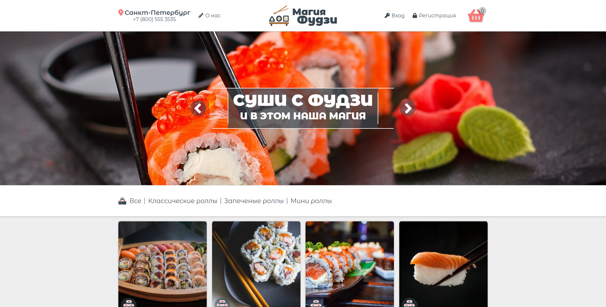

# Fuji Magia

📄 **fujimagia** - это мой первый командный проект двух начинающих разработчиков, для закрепления изученного материла. **Магия Фудзи** - это аналог уже привычных нам интернет-магазинов. Дизайн придумывался на ходу и по мере работы. Концепт был взят с сайта: [СушиШоп](https://sushishop.ru/).

---

## about:

📑 Разработка проекта велась в кротчайшие сроки и часть технологий изучалась на ходу методом тыка. Задачей было разработать аналог простого интернет магазина с минимальным набором требуемого функционала и приемлемым оформлением:

- 📝 Краткий очерк по проделанной работе:
  - Это был первый опыт в использовании **Git** для ведения совместной разработки;
  - Первая практика в применении **JQuery** и создание **Backend** на **PHP**;
  - И самое главное - плодотворный опыт командой работы;

📑 **Разработку вели:**

> ⠀
> **Layout & Git:** <u>[lapard1n](https://github.com/lapard1n)</u>;
> **Frontend + Backend:** <u>[whereismm](https://github.com/whereismm)</u>;
> ⠀

---

## warning:

> 📌 _Работа над проектом прекращена:_
>
> > **fujimagia** _- это не адаптивный проект._
>
> **P.s.** _- здесь много легаси и не валидного кода._

---

<h1 align="center"><a href="https://lapard1n.github.io/fujimagia">fujimagia:</a></h1>

---
